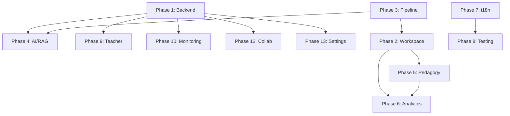

# Comprehensive Upgrade Plan: ai_tutor_studio → synapse-learning Parity

## Executive Summary

The `synapse-learning` project is a production-grade learning platform with ~500+ source files, 189 unit tests, 44 E2E tests, a dedicated Express+Postgres backend, MCP server, Capacitor mobile apps, and deeply integrated study tools. The local `ai_tutor_studio` project shares the same educational DNA but is at an earlier stage (~80 source files, 37 tests, monolithic server.ts).

This plan upgrades `ai_tutor_studio` to achieve functional parity across **14 major dimensions** while preserving all existing functionality.

---

## Gap Analysis Matrix

| Dimension | synapse-learning | ai_tutor_studio | Gap Severity |
|-----------|-----------------|-----------------|--------------|
| Backend Architecture | Dedicated Express+Postgres+Redis+BullMQ server | Monolithic server.ts (in-memory) | 🔴 Critical |
| Study Workspace | 11 tools, 110+ workspace files, cross-tool concept bus | Basic workspace shell | 🔴 Critical |
| Content Pipeline | 53KB contentAnalysis, 52KB extractors, workers | 6KB contentAnalysis, 5KB extractors | 🔴 Critical |
| AI/RAG System | 16KB RAG, 18KB LLM client, local embeddings, proactive agent | 5KB RAG, basic Gemini calls | 🟠 High |
| Spaced Repetition | FSRS-5, IRT quizzes, Leitner boxes, adaptive scheduler | Basic FSRS, simple flashcards | 🟠 High |
| Analytics | 42KB analytics, knowledge flow, visual lab, 9 chart types | Basic recharts, minimal analytics | 🟠 High |
| i18n | 246KB dictionary, locale formatting, lint tooling | 2KB basic i18n hook | 🟠 High |
| Testing | 189 unit + 44 E2E + a11y + visual regression + perf | 37 unit + basic e2e | 🟡 Medium |
| Teacher/Institutional | Full teacher dashboard, LTI, SAML, cohorts, org model | None | 🟡 Medium |
| Collaboration | Study rooms, Jitsi, concept map CRDT, annotation sync | Basic Yjs collab room | 🟡 Medium |
| Mobile/Native | Capacitor iOS+Android, Fastlane CI/CD | None | 🟡 Medium |
| Monitoring | Sentry, OpenTelemetry, chunk error reporter, telemetry | None | 🟡 Medium |
| Settings & Auth | 32KB settings, JWT refresh, password reset, billing | Basic Firebase auth | 🟡 Medium |
| UI System | 30KB Shell, command palette, view transitions, product tour | Layout + pages | 🟢 Low (partially addressed) |

---

## Implementation Phases (Priority Order)

### Phase 1: Backend Architecture Separation (🔴 Critical)
**Goal:** Extract server.ts into a proper backend with persistence, auth, and API structure.

| Task | Files to Create/Modify | Effort |
|------|----------------------|--------|
| 1.1 Create `server/` directory with Express + TypeScript | `server/src/index.ts`, `server/package.json`, `server/tsconfig.json` | L |
| 1.2 Postgres database with migrations | `server/src/db/`, `server/migrations/`, `docker-compose.yml` | L |
| 1.3 JWT authentication (register/login/refresh/me) | `server/src/routes/auth.ts`, `server/src/middleware/` | M |
| 1.4 Library sync endpoints (GET/PUT /v1/library) | `server/src/routes/library.ts` | M |
| 1.5 Session sync endpoints (GET/PUT /v1/session) | `server/src/routes/session.ts` | M |
| 1.6 LLM proxy (/v1/chat/completions) with usage metering | `server/src/routes/proxy.ts`, `server/src/lib/rateLimitStore.ts` | M |
| 1.7 YouTube transcript proxy | `server/src/routes/youtube.ts` | S |
| 1.8 OCR proxy endpoint | `server/src/routes/ocr.ts` | S |
| 1.9 Admin stats endpoint | `server/src/routes/admin.ts` | S |
| 1.10 Redis cache + BullMQ job queue | `server/src/lib/redisClient.ts`, `server/src/jobs/` | M |
| 1.11 Health/readiness probes | `server/src/lib/readiness.ts`, `server/src/lib/productionProbe.ts` | S |

**Client-side wiring:**
| Task | Files | Effort |
|------|-------|--------|
| 1.12 `authClient.ts` — full auth client with refresh | `src/lib/authClient.ts` | M |
| 1.13 `librarySync.ts` — server pull/push + merge | `src/lib/librarySync.ts` | M |
| 1.14 `sessionSync.ts` — server session sync | `src/lib/sessionSync.ts` | M |

---

### Phase 2: Study Workspace Deep Upgrade (🔴 Critical)
**Goal:** Match the 11-tool workspace with cross-tool coherence.

| Task | Component | Source Reference | Effort |
|------|-----------|-----------------|--------|
| 2.1 CognitiveReader — full document reader with layout, math, annotations | `workspace/CognitiveReader.tsx` | 56KB | XL |
| 2.2 DraggableConceptMap — force layout, hierarchy, collaboration | `workspace/DraggableConceptMap.tsx` | 42KB | XL |
| 2.3 StudyWhiteboard — diagram coach, LaTeX stamps, layers | `workspace/StudyWhiteboard.tsx` | 32KB | L |
| 2.4 FormulaScratchpad — SymPy via Pyodide, formula solver | `workspace/FormulaScratchpad.tsx` | 23KB | L |
| 2.5 LeitnerBox — FSRS scheduling, due queues, interleaving | `workspace/LeitnerBox.tsx` | 18KB | L |
| 2.6 FeynmanCheck — rubric, gap detection, voice | `workspace/FeynmanCheck.tsx` | 22KB | L |
| 2.7 InteractiveSimulator — parametric simulations | `workspace/InteractiveSimulator.tsx` | 18KB | M |
| 2.8 QuizPanel — IRT adaptive quizzing | `workspace/QuizPanel.tsx` | 9.6KB | M |
| 2.9 DebatePanel — argumentation trees | `workspace/DebatePanel.tsx` | 7.4KB | M |
| 2.10 ComparePanel — document comparison | `workspace/ComparePanel.tsx` | 7.7KB | M |
| 2.11 StudyTimer — Pomodoro + exam countdown | `workspace/StudyTimer.tsx` | 16KB | M |
| 2.12 StudyRoomPanel — multiplayer with Jitsi | `workspace/StudyRoomPanel.tsx` | 8.9KB | M |
| 2.13 AnnotationOverlay — margin rail, remap, toolbar | `workspace/AnnotationOverlay.tsx` | 27KB | L |
| 2.14 Cross-tool concept bus | `lib/workspaceConceptBus.ts` | 7.3KB | M |
| 2.15 Workspace focus bus | `lib/workspaceFocus.ts` | S |
| 2.16 Workspace persistence (per-progressKey) | `lib/workspacePersistence.ts` | 7.5KB | M |
| 2.17 Workspace tool registry (11-tool) | `lib/workspaceToolRegistry.ts` | 4.2KB | S |
| 2.18 WorkspaceDock + ToolStrip + MobileDrawer | UI components | M |
| 2.19 Workspace keyboard shortcuts | `lib/workspaceKeyboardShortcuts.ts` | 6.7KB | M |
| 2.20 Workspace empty states | `lib/workspaceEmptyState.ts` | 13KB | M |

---

### Phase 3: Content Pipeline Enhancement (🔴 Critical)
**Goal:** Match the sophisticated content extraction and analysis pipeline.

| Task | Module | Effort |
|------|--------|--------|
| 3.1 Enhanced contentAnalysis (RAKE+TextRank, sections, prereqs, definitions) | Expand to ~50KB | XL |
| 3.2 Enhanced noteContentExtractors (per-tool extractors) | Expand to ~50KB | XL |
| 3.3 readerDocumentLayout.ts — segment classification | New 15KB | L |
| 3.4 Enhanced textSegmentation (page breaks, Greek patterns, headings) | Expand to ~25KB | L |
| 3.5 pdfExtract.ts — advanced PDF with layout blocks, math zones | New 13KB | L |
| 3.6 Bilingual OCR ensemble (Greek + Latin) | `lib/bilingualOcrEnsemble.ts` | M |
| 3.7 Greek text repair | `lib/greekTextRepair.ts` (24KB) | L |
| 3.8 Recognition worker (off-thread course outline) | `workers/recognition.worker.ts` | M |
| 3.9 Document model with snapshots | `lib/documentModel.ts` (16KB) | L |
| 3.10 Upload pipeline enhancement (validation, transactions) | Expand to ~13KB | M |
| 3.11 Pipeline migration system | `lib/pipelineMigration.ts` | S |
| 3.12 Source quality scoring enhancement | Expand to ~12KB | M |
| 3.13 Course quality gates | `lib/courseQualityGates.ts` (8.6KB) | M |

---

### Phase 4: AI & RAG Enhancement (🟠 High)
**Goal:** Production-grade RAG with local embeddings and proactive agent.

| Task | Module | Effort |
|------|--------|--------|
| 4.1 Enhanced RAG (hybrid BM25 + embedding reranker) | Expand to ~16KB | L |
| 4.2 Full LLM client (streaming, proxy, fallback, multi-provider) | `lib/llmClient.ts` 18KB | L |
| 4.3 Local embeddings via @huggingface/transformers | `lib/localEmbedder.ts` | M |
| 4.4 Agent workspace context (tool-aware prompts) | `lib/agentWorkspaceContext.ts` 9KB | M |
| 4.5 Agent commands system | `lib/agentCommands.ts` 6KB | M |
| 4.6 Proactive agent alerts | `lib/proactiveAgentAlerts.ts` 4.5KB | M |
| 4.7 Agent multi-doc synthesis | `lib/agentMultiDocSynthesize.ts` | S |
| 4.8 Grounded feedback for quiz | `lib/quizGroundedFeedback.ts` | S |
| 4.9 Step-grounded excerpts | `lib/stepGroundedExcerpt.ts` | S |
| 4.10 RAG synthesis with citations | `lib/ragSynthesisCitations.ts` | S |

---

### Phase 5: Spaced Repetition & Pedagogy (🟠 High)
**Goal:** Full FSRS-5, IRT quizzing, and adaptive scheduling.

| Task | Module | Effort |
|------|--------|--------|
| 5.1 Unified adaptive scheduler | `lib/unifiedAdaptiveScheduler.ts` 13KB | L |
| 5.2 Quiz IRT (Item Response Theory) | `lib/quizIrt.ts` 7.3KB | M |
| 5.3 Leitner deck sync + due queue | `lib/leitnerDeckSync.ts`, `lib/leitnerDueQueue.ts` | M |
| 5.4 Leitner interleaving | `lib/leitnerInterleaving.ts` | S |
| 5.5 Leitner custom cards + card types | `lib/leitnerCustomCards.ts`, `lib/leitnerCardTypes.ts` | M |
| 5.6 Enhanced pedagogy (beta mastery, prerequisite repairs) | Expand `lib/pedagogy.ts` → 8.6KB | M |
| 5.7 Confidence gating | `lib/confidenceGating.ts` | S |
| 5.8 Exam practice presets | `lib/examPracticePresets.ts` 4.6KB | M |
| 5.9 Spaced step schedule | `lib/spacedStepSchedule.ts` 4.8KB | M |
| 5.10 Quiz session model + attempt history | `lib/quizSession.ts`, `lib/quizAttemptHistory.ts` | M |
| 5.11 Anki import/export | `lib/ankiApkg.ts` 10KB | M |

---

### Phase 6: Analytics Deep Upgrade (🟠 High)
**Goal:** Comprehensive learning analytics with visual lab.

| Task | Component | Effort |
|------|-----------|--------|
| 6.1 Enhanced Analytics page (42KB) | `components/Analytics.tsx` | XL |
| 6.2 Knowledge flow analytics | `lib/knowledgeFlowAnalytics.ts` 16KB | L |
| 6.3 Progress insights | `lib/progressInsights.ts` 9.9KB | M |
| 6.4 Retention analytics | `lib/retentionAnalytics.ts` 3.7KB | M |
| 6.5 Concept mastery heatmap chart | `analytics/ConceptMasteryHeatmapChart.tsx` | M |
| 6.6 Knowledge flow Sankey diagram | `analytics/KnowledgeFlowSankey.tsx` 8.2KB | M |
| 6.7 Concept treemap chart | `analytics/ConceptTreemapChart.tsx` 4.4KB | M |
| 6.8 Learning timeline chart | `analytics/LearningTimelineChart.tsx` 5.5KB | M |
| 6.9 Retention sparkline board | `analytics/RetentionSparklineBoard.tsx` | S |
| 6.10 Visual lab modes | `lib/visualLabModes.ts` | S |
| 6.11 Progress session export | `lib/progressSessionExport.ts` 11KB | M |
| 6.12 Activity analytics (heatmap + streak from real data) | `lib/activityAnalytics.ts` | S |
| 6.13 Dashboard weak spots model | `lib/dashboardWeakSpotsModel.ts` | M |
| 6.14 Dashboard next action engine | `lib/dashboardNextAction.ts`, `lib/nextActionEngine.ts` | M |

---

### Phase 7: i18n Full Dictionary (🟠 High)
**Goal:** Complete bilingual Greek/English dictionary matching synapse-learning's 246KB i18n.

| Task | Description | Effort |
|------|-------------|--------|
| 7.1 Expand `i18n.tsx` to full dictionary coverage | All UI strings, tool labels, error messages | XL |
| 7.2 Locale formatting utilities | `lib/localeFormat.ts` (numbers, dates, relative time) | M |
| 7.3 i18n-lint script | `scripts/i18n-lint.mjs` | M |
| 7.4 Translate all workspace tool labels + descriptions | Bilingual labels for 11 tools | M |
| 7.5 Translate settings, onboarding, landing copy | Complete coverage | L |

---

### Phase 8: Testing & Quality (🟡 Medium)
**Goal:** Match the 189 unit + 44 E2E test coverage.

| Task | Description | Effort |
|------|-------------|--------|
| 8.1 Unit tests for content pipeline | contentAnalysis, noteContentExtractors, textSegmentation | L |
| 8.2 Unit tests for spaced repetition | FSRS, IRT, Leitner, adaptive scheduler | M |
| 8.3 Unit tests for RAG | BM25, embedding, reranker | M |
| 8.4 E2E: upload lifecycle | File upload → course generation → workspace | M |
| 8.5 E2E: workspace tools | Each tool opens, has content, accepts input | L |
| 8.6 E2E: accessibility | axe-core + WCAG AA on all pages | M |
| 8.7 E2E: visual regression | Screenshot comparisons for key pages | M |
| 8.8 E2E: performance budgets | LCP, FID, CLS thresholds | M |
| 8.9 eval suite for AI quality | Agent response quality evaluation | M |
| 8.10 doc-lint script | Documentation consistency checking | S |

---

### Phase 9: Teacher & Institutional (🟡 Medium)
**Goal:** Teacher dashboard, LTI, student organizations.

| Task | Component | Effort |
|------|-----------|--------|
| 9.1 TeacherDashboard (cohort management, assignments, grading) | 54KB | XL |
| 9.2 LTI 1.3 integration (launch, grade passback, roster sync) | Server routes + client | XL |
| 9.3 Student organization view | `StudentOrgView.tsx` 19KB | L |
| 9.4 Assignment discussion threads | `AssignmentDiscussionThread.tsx` 13KB | M |
| 9.5 Cohort heatmaps (topic mastery, NotebookLM) | Multiple heatmap components | M |
| 9.6 Google integrations panel (Calendar, Classroom) | `GoogleIntegrationsPanel.tsx` 16KB | L |
| 9.7 SAML SSO authentication | `server/src/lib/saml*.ts` | L |

---

### Phase 10: Monitoring & DevOps (🟡 Medium)
**Goal:** Production monitoring, error tracking, telemetry.

| Task | Module | Effort |
|------|--------|--------|
| 10.1 Sentry integration (client + server) | `lib/sentryInit.ts` | M |
| 10.2 OpenTelemetry (traces + metrics) | `server/src/lib/telemetry.ts` | M |
| 10.3 Chunk error reporter + recovery | `lib/chunkErrorReporter.ts`, `lib/lazyWithRetry.ts` | M |
| 10.4 Production probes dashboard | `server/src/lib/productionProbe.ts` 8.4KB | M |
| 10.5 Offline sync queue | `lib/offlineSyncQueue.ts` | S |
| 10.6 Retention sweep (data lifecycle) | `server/src/lib/retentionSweep.ts` | S |
| 10.7 Audit log export | `server/src/lib/auditLogExport.ts` | S |

---

### Phase 11: Mobile / Native (🟡 Medium)
**Goal:** iOS + Android via Capacitor.

| Task | Description | Effort |
|------|-------------|--------|
| 11.1 Capacitor setup (capacitor.config.ts, native projects) | Config + initial scaffold | M |
| 11.2 Network status detection | `lib/capacitorNetwork.ts` | S |
| 11.3 Mobile workspace drawer | `WorkspaceMobileToolDrawer.tsx` | M |
| 11.4 Mobile intelligence bottom sheet | `WorkspaceMobileIntelligenceBottomSheet.tsx` | M |
| 11.5 Fastlane for iOS/Android build + beta distribution | `mobile/` directory | L |
| 11.6 Platform-specific PWA manifest + icons | `public/` assets | S |

---

### Phase 12: Collaboration Enhancement (🟡 Medium)
**Goal:** Full real-time collaboration with study rooms and Jitsi.

| Task | Component | Effort |
|------|-----------|--------|
| 12.1 Study room client + server (Yjs, shared state) | `lib/studyRoomClient.ts` 10KB | L |
| 12.2 Jitsi Meet embed | `workspace/JitsiMeetEmbed.tsx` 8KB | M |
| 12.3 Concept map collaboration (CRDT cursor sync) | `lib/conceptMapCollab.ts` + hooks | M |
| 12.4 Annotation real-time sync | `lib/annotationRealtimeSync.ts` | M |
| 12.5 Hocuspocus server integration | `server/src/collab/` | M |
| 12.6 Shared notes in study rooms | `workspace/StudyRoomSharedNotes.tsx` | S |

---

### Phase 13: Settings & Auth Enhancement (🟡 Medium)
**Goal:** Full settings page with billing, themes, security.

| Task | Component | Effort |
|------|-----------|--------|
| 13.1 Enhanced Settings page (account, billing, themes, notifications, privacy) | 32KB | L |
| 13.2 Onboarding flow (profile, preferences, demo) | 25KB | L |
| 13.3 Product tour + workspace tour | `lib/productTour.ts`, hooks | M |
| 13.4 Stripe billing integration | Server + client | L |
| 13.5 Password reset + token refresh | Auth flows | M |
| 13.6 Theme system (multiple themes, contrast ratios) | `lib/theme.ts` 4KB | M |

---

### Phase 14: UI/UX Platform Shell (🟢 Partially Done)
**Goal:** Match the production shell with landing, command palette, navigation.

| Task | Component | Effort |
|------|-----------|--------|
| 14.1 Production landing page | `Landing.tsx` 20KB | L |
| 14.2 Enhanced Shell/Layout (breadcrumbs, skip links, responsive nav) | `Shell.tsx` 30KB | L |
| 14.3 Workspace command palette | `workspace/CommandPalette.tsx` 8KB | M |
| 14.4 Notification toast stack with priorities | `NotificationToastStack.tsx` | M |
| 14.5 Offline shell banner | `OfflineShellBanner.tsx` | S |
| 14.6 Error boundary with chunk recovery | `ErrorBoundary.tsx` 3.4KB | M |
| 14.7 Platform view transitions | `ui/PlatformViewTransition.tsx` | S |
| 14.8 UX shimmer skeletons | `ui/UxShimmerSkeleton.tsx` | S |
| 14.9 Plugin marketplace panel | `PluginMarketplacePanel.tsx` | M |

---

## MCP Server Integration

The synapse-learning project includes a full MCP (Model Context Protocol) server:

| Component | Description | Effort |
|-----------|-------------|--------|
| MCP server core | JSON-RPC 2.0 transport, tool/resource/prompt capabilities | L |
| MCP tools | list_courses, get_course_outline, search_library, get_progress, generate_quiz, create_flashcard, add_annotation | L |
| MCP OAuth 2.1 | RFC9728, RFC7591 dynamic registration, PKCE authorization | L |
| MCP resources | library/summary, course/{id} | M |
| MCP prompts | study_plan, explain_weak_areas, quiz_me | M |

---

## Effort Estimates

| Size | Hours | Description |
|------|-------|-------------|
| S | 1-2h | Small utility, single file |
| M | 3-6h | Component or module with moderate logic |
| L | 8-16h | Complex component or multi-file feature |
| XL | 20-40h | Major subsystem requiring deep implementation |

---

## Recommended Execution Order

```
Phase 1 (Backend)     ████████████████ 🔴 FIRST — enables all server features
Phase 3 (Pipeline)    ████████████████ 🔴 SECOND — content is the product's core
Phase 2 (Workspace)   ████████████████ 🔴 THIRD — the study experience
Phase 4 (AI/RAG)      ████████████     🟠 enhances agent + grounding
Phase 5 (Pedagogy)    ████████████     🟠 learning science core
Phase 6 (Analytics)   ████████████     🟠 user insights + retention
Phase 7 (i18n)        ████████         🟠 complete bilingual coverage
Phase 8 (Testing)     ████████         🟡 quality assurance
Phase 9 (Teacher)     ████████████     🟡 institutional market
Phase 10 (Monitoring) ████████         🟡 production stability
Phase 11 (Mobile)     ████████         🟡 native distribution
Phase 12 (Collab)     ████████         🟡 social learning
Phase 13 (Settings)   ████████         🟡 user management
Phase 14 (UI Shell)   ████████         🟢 partially done
```

---

## Key Dependencies Between Phases



---

## Constraints & Principles

1. **No functionality removal** — all existing features are preserved or enhanced
2. **TypeScript strict** — all new code must pass `tsc --noEmit`
3. **Test coverage** — every new module needs ≥1 unit test
4. **i18n** — all new UI strings use `t()` with Greek + English
5. **Accessibility** — WCAG AA compliance, keyboard navigation, screen reader support
6. **Mobile-first** — responsive design, touch targets ≥ 44px
7. **Offline-capable** — graceful degradation when server unavailable
8. **Performance** — bundle splitting, lazy loading, web workers for heavy computation

---

## Files to Add (estimated new file count per phase)

| Phase | New Files | Modified Files |
|-------|-----------|---------------|
| 1 | ~25 (server/) | ~5 (client sync) |
| 2 | ~40 (workspace/) | ~3 (store, routes) |
| 3 | ~20 (lib/) | ~5 (pipeline) |
| 4 | ~10 (lib/) | ~3 (agent) |
| 5 | ~12 (lib/) | ~3 (store) |
| 6 | ~15 (analytics/) | ~2 (routes) |
| 7 | ~3 (lib/) | ~20 (all pages) |
| 8 | ~50 (tests/) | ~0 |
| 9 | ~15 (teacher/) | ~5 (server) |
| 10 | ~8 (monitoring/) | ~5 |
| 11 | ~10 (mobile/) | ~5 |
| 12 | ~8 (collab/) | ~5 |
| 13 | ~8 (settings/) | ~3 |
| 14 | ~10 (ui/) | ~5 |
| **Total** | **~234** | **~69** |

---

*Generated: 2025-07-13. Based on exhaustive comparison of both codebases.*
